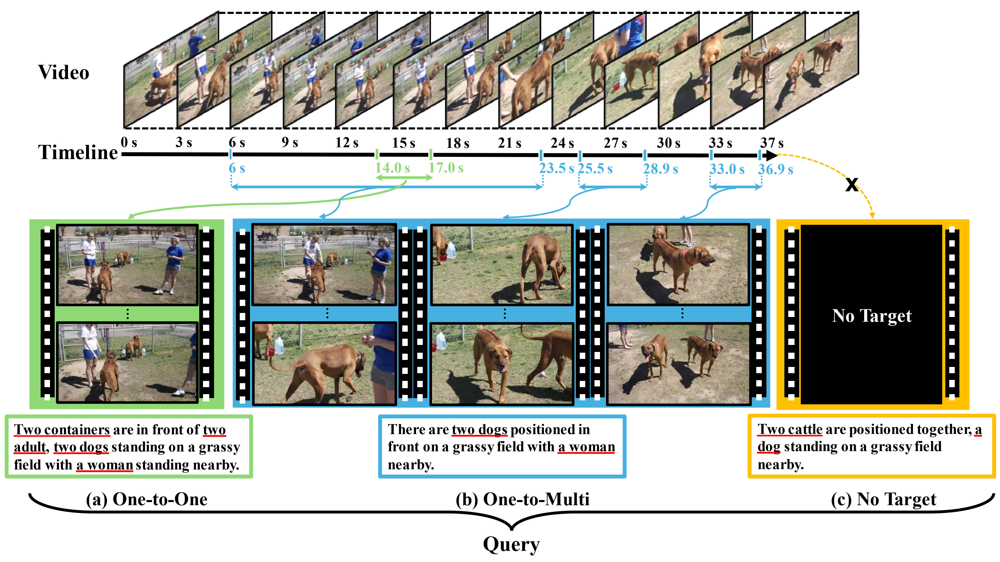
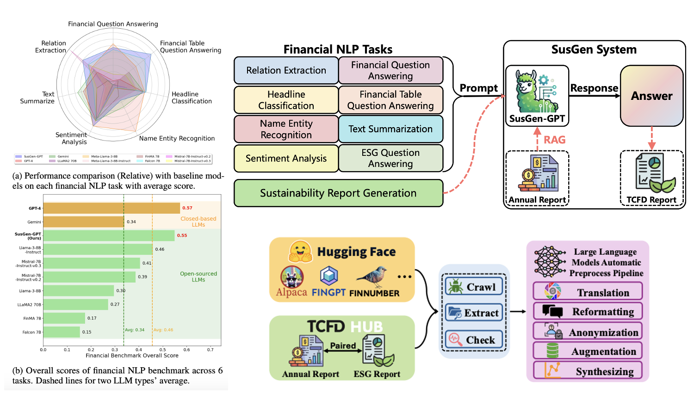
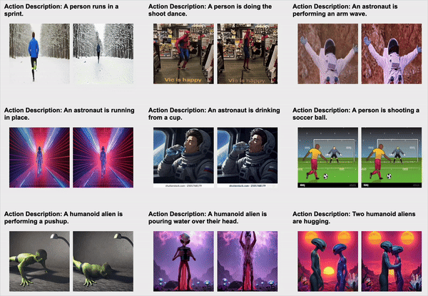
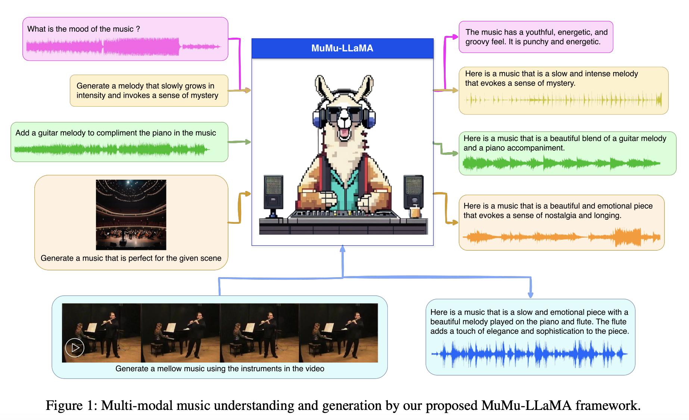
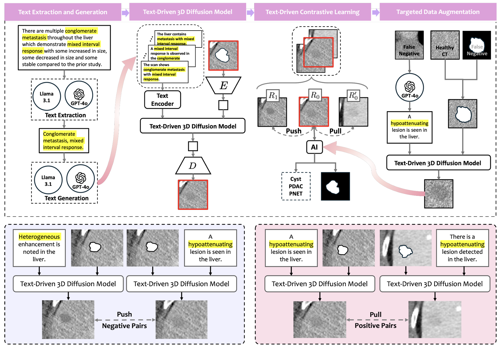
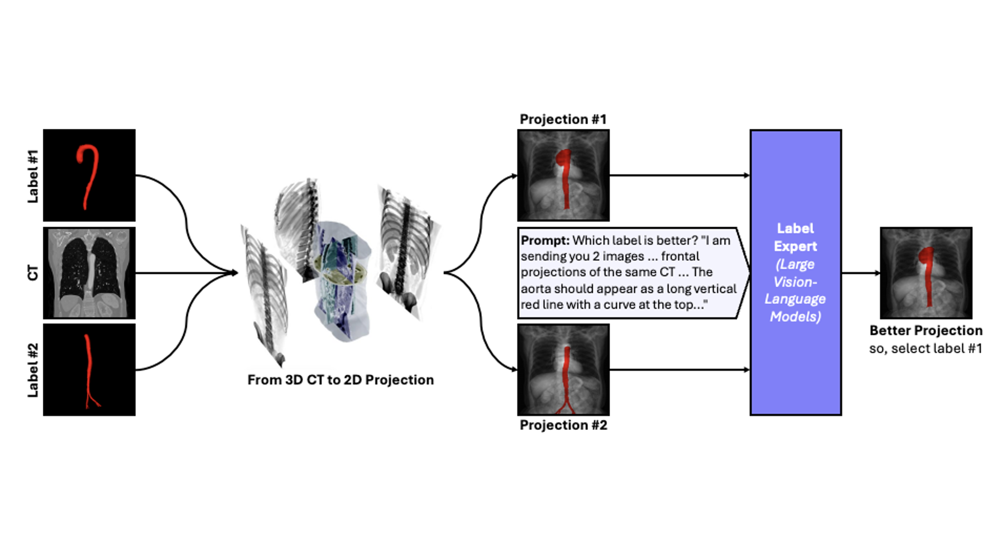

Hi! I’m a MSc student at **National University of Singapore**, and I became extreme passionate about AI since Sep. 2023. I'm currently working at OpenGV-Alpha@**Shanghai AI Lab** mentored by [Dr. Peng Gao](https://scholar.google.com/citations?hl=en&user=_go6DPsAAAAJ&view_op=list_works&sortby=pubdate). And I was luckily advised by [Dr. Zongwei Zhou](https://scholar.google.com/citations?user=JVOeczAAAAAJ&hl=en) and Bloomberg Distinguished [Prof. Alan L. Yuille](https://scholar.google.com/citations?user=FJ-huxgAAAAJ&hl) at [CCVL](https://ccvl.jhu.edu/)@**Johns Hopkins University**. Previously, I also spent a wonderful time with [Prof. Bharadwaj Veeravalli](https://scholar.google.com/citations?user=IqAJttsAAAAJ&hl=en), [Prof. Roger Zimmermann](https://scholar.google.com.tw/citations?user=IDREwXEAAAAJ)@NUS. Prior to that, I received my BSc degree in Physics, focusing on Nonlinear Dynamics & Chaos Theory and Bio-Physics. 
My current research interests lie in **Multi-modal learning**, spanning video, image, action, audio, planning, medical, etc., with a broader focus on leveraging **diffusion models**, **physics-informed** learning and **LLMs** for diverse real-world applications; Additionally, I am also keen on exploring **why** these models work and how to make them more interpretable and robust.

News
------
•	**[Jan. 2025]** One paper is accepted by [**ICLR 2025**](https://iclr.cc/) 🎉! 
•	**[Jan. 2025]** One paper about is accepted by [**IEEE ISBI 2025**](https://signalprocessingsociety.org/blog/isbi-2025-2025-ieee-international-symposium-biomedical-imaging) 🎉! 
•	**[Jan. 2025]** We release [**SusGen-GPT**](https://github.com/JerryWu-code/SusGen), LLMs for financial NLP and sustainability report generation 📈. 
•	**[Dec. 2024]** We release newest version [**MuMu-LLaMA**](https://github.com/shansongliu/MuMu-LLaMA) for multi-modal music understanding and generation 🎸. 
•	**[Dec. 2024]** We release [**TextoMorph**](https://github.com/MrGiovanni/TextoMorph), text-driven tumor synthesis 🧬. 
•	**[Nov. 2024]** We release [**Label Critic**](https://github.com/PedroRASB/Cerberus), VLM pipeline for detecting data issues in medical images 🕵️.

Publications & Preprints
------
\* Equal contribution, † Corresponding author

### Generalized Video Moment Retrieval

You Qin*, <strong>Qilong Wu*</strong>, Yicong Li, Wei Ji†, Li Li, Pengcheng Cai, Lina Wei, Roger Zimmermann† 
Accepted by <strong>ICLR</strong>, 2025 |
<a href="https://openreview.net/pdf?id=qdOIkeZ5e4">Paper</a> |
<a href="{{ site.baseurl }}/files/bibtex/gvmr.txt" target="_blank">BibTeX</a>
 

------

### SusGen-GPT: A Data-Centric LLM for Financial NLP and Sustainability Report Generation

<strong>Qilong Wu†</strong>, Xiaoneng Xiang, Huang Hejia, Xuan Wang, Yeo Wei Jie, Ranjan Satapathy, Ricardo Shirota Filho, and Bharadwaj Veeravalli 
arXiv Preprint, Under Review in <strong>NAACL</strong>, 2025 |
<a href="https://arxiv.org/pdf/2412.10906">Paper</a> |
<a href="https://github.com/JerryWu-code/SusGen">Code</a> |
<a href="{{ site.baseurl }}/files/susgen_demo.mp4" target="_blank">Video Demo</a> |
<a href="{{ site.baseurl }}/files/bibtex/susgen.txt" target="_blank">BibTeX</a>
 

------

### Learning to Animate Images from A Few Videos to Portray Delicate Human Actions

Haoxin Li, Yingchen Yu, <strong>Qilong Wu</strong>, Hanwang Zhang, Boyang Li, Song Bai† 
Under Review in <strong>CVPR</strong>, 2025 |
<a href="https://openreview.net/pdf?id=3By4N0GAdt">Paper</a> |
<a href="https://cva2099.github.io/human_action_animation/">Project Page</a> |
<a href="{{ site.baseurl }}/files/bibtex/cva.txt" target="_blank">BibTeX</a>
 

------

### MuMu-LLaMA: Multi-modal Music Understanding and Generation via Large Language Models

Shansong Liu*†, Atin Sakkeer Hussain*, <strong>Qilong Wu*</strong>, Sun Chenshuo, Ying Shan 
arXiv Preprint, Under Review in <strong>IEEE J-STSP</strong>, 2025 |
<a href="https://arxiv.org/pdf/2412.06660">Paper</a> |
<a href="https://github.com/shansongliu/M2UGen">Code</a> |
<a href="{{ site.baseurl }}/files/Mumullama_demo.mp4" target="_blank">Video Demo</a> |
<a href="https://crypto-code.github.io/MuMu-LLaMA_Demo/">Website</a> |
<a href="{{ site.baseurl }}/files/bibtex/mumullama.txt" target="_blank">BibTeX</a>
 

------

### Text-Driven Tumor Synthesis

Xinran Li, Yi Shuai, Chen Liu, Qi Chen, <strong>Qilong Wu</strong>, Pengfei Guo, Dong Yang, Can Zhao, Pedro R. A. S. Bassi, Daguang Xu, Kang Wang, Yang Yang, Alan Yuille, Zongwei Zhou† 
arXiv Preprint, Under Review in <strong>CVPR</strong>, 2025 |
<a href="https://arxiv.org/pdf/2412.18589">Paper</a> |
<a href="https://github.com/MrGiovanni/TextoMorph">Code</a> |
<a href="{{ site.baseurl }}/files/bibtex/textmorph.txt" target="_blank">BibTeX</a>
 

------

### Label Critic: Design Data Before Models

Pedro R. A. S. Bassi, <strong>Qilong Wu</strong>, Wenxuan Li, Sergio Decherchi, Andrea Cavalli, Alan Yuille, Zongwei Zhou† 
Accepted by <a href="https://app.gleanin.com/share/campaigns/30001/variants"><strong>IEEE ISBI</strong></a>, 2025 |
<a href="https://arxiv.org/pdf/2411.02753">Paper</a> |
<a href="https://github.com/PedroRASB/Cerberus">Code</a> |
<a href="{{ site.baseurl }}/files/bibtex/labcri.txt" target="_blank">BibTeX</a>
 

------

### ScaleMAI: Accelerating the Development of Trusted Datasets and AI Models

Wenxuan Li, Pedro R. A. S. Bassi, Tianyu Lin, Yu-Cheng Chou, Xinze Zhou, Yucheng Tang, Fabian Isensee, Kang Wang, Qi Chen, Xiaowei Xu, Xiaoxi Chen, Lizhou Wu, <strong>Qilong Wu</strong>, Yannick Kirchhoff, Maximilian Rokuss, Saikat Roy, Yuxuan Zhao, Dexin Yu, Kai Ding, Constantin Ulrich, Klaus Maier-Hein, Yang Yang, Alan L. Yuille, Zongwei Zhou† 
arXiv Preprint, Under Review in <strong>CVPR</strong>, 2025 |
<a href="https://www.cs.jhu.edu/~zongwei/publication/li2025scalemai.pdf">Paper</a> |
<a href="https://github.com/MrGiovanni/ScaleMAI">Code</a> |
<a href="{{ site.baseurl }}/files/bibtex/scalemai.txt" target="_blank">BibTeX</a>
 

------

Academic Services
------
•	Reviewer of International Conference on Machine Learning (**ICML**), 2025. 
•	Reviewer of International Conference on Learning Representations (**ICLR**), 2025. 
•	Reviewer of International Conference on Artificial Intelligence and Statistics (**AISTATS**), 2025. 
•	Reviewer of Conference on Neural Information Processing Systems (**NIPS**), 2024. 
•	Reviewer of ACM International Conference on Multimedia (**ACM MM**), 2024. 

Miscellaneous
------
•	**President** of the Student Union in Physics Department, 2020-2021. 
•	Prepared to be a professional mobile game player in **SanGuoSha Mobile** in my Bachelor period but failed, finally ranked 243th **Nationally** over 10,000,000 players, 2021-2022. 
•	Accomplished the First Peak of Mount Siguniang (**5,038m**) [[news](http://bbs.lvye.cn/thread-2635185-1-1.html)] and the Main peak of Que’er Mountain (**6,168m**) [[news](http://bbs.lvye.cn/thread-2635578-1-1.html)], 2019. 
•	Coded in Quick-Basic45 language for two years and won the **Champion** in the Java/C++/Basic Programing Competition in Beijing Shunyi District over more than a thousand participants when I was 12 in elementary school, 2012. [[code](https://github.com/JerryWu-code/Code-Memory)] 

GitHub Stats
------
<picture>
  <source media="(prefers-color-scheme: dark)" srcset="https://raw.githubusercontent.com/JerryWu-code/JerryWu-code/output/contribution-snake-dark.svg">
  <source media="(prefers-color-scheme: light)" srcset="https://raw.githubusercontent.com/JerryWu-code/JerryWu-code/output/contribution-snake.svg">
  
</picture>